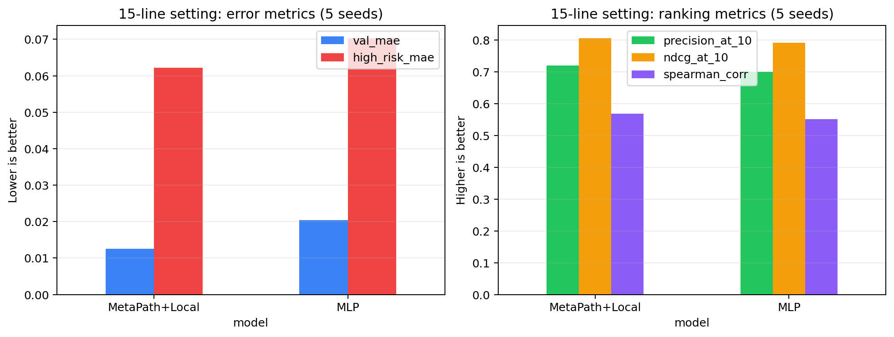
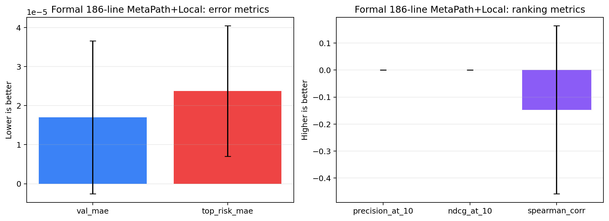
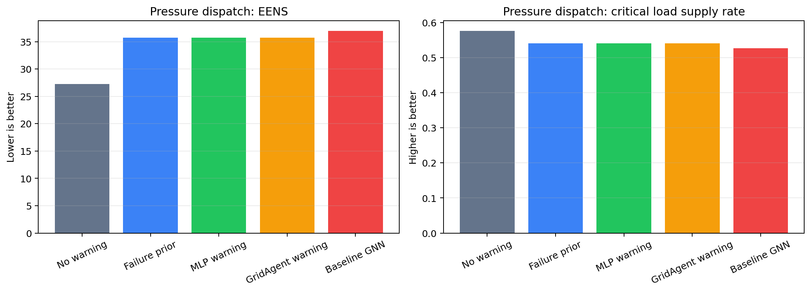
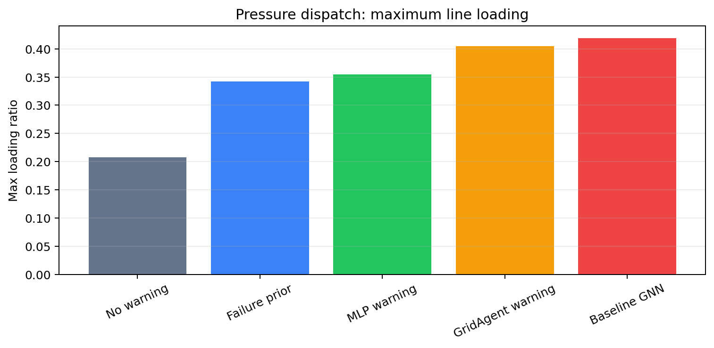

# Stage6 实验总结与下游压力场景验证

## 1. 实验目标

本轮 Stage6 实验主要围绕三个问题展开：

1. 当前 Stage6/GridAgent-Risk 是否已经包含 attention 机制。
2. 是否可以通过 MetaPath+Local、ranking loss 或 risk-aware attention 提升 Top-k 高风险线路排序。
3. 如果 Stage6 warning 的优势主要体现在低 MAE/稳定概率预警，那么它接入 Stage7 后是否能降低 EENS、减少过载、提高关键负荷供给率。

最终判断是：Stage6 主模型仍应以 GridAgent-Risk / MetaPath V1 为基础，优先保证 MAE/RMSE；MLP 作为 Top-k 排序最强 baseline；MetaPath+Local、RiskAttn 和 ranking loss 保留为消融探索。

## 2. Stage6 Attention 机制确认

项目中并不是完全没有 attention。当前 Stage6 已经包含：

- GAT baseline：普通图注意力对照模型。
- MetaPath semantic attention：GridAgent-Risk / MetaPath V1 中对不同 metapath 语义路径计算 attention 权重。
- 输出解释文件：`metapath_attention_summary.csv`。

因此更准确的表述是：

> 项目已有 GAT attention 和 metapath-level semantic attention，但缺少专门面向 Top-k 高风险线路排序的 line-level risk-aware attention。

## 3. MetaPath+Local 实验

MetaPath+Local 在 MetaPath V1 图分支之外增加 MLP-style local branch，用来保留线路自身局部强信号，再通过 learnable gate 融合 local branch 和 metapath graph branch。

### 3.1 15 线路 5-seed 稳定性结果

在 15 线路实验设置下，MetaPath+Local 相比 MLP 有较好表现。

| 模型 | Val MAE | High-risk MAE | Precision@10 | NDCG@10 | Spearman |
|---|---:|---:|---:|---:|---:|
| MLP | 0.0204 | 0.0703 | 0.7000 | 0.7920 | 0.5517 |
| MetaPath+Local | **0.0125** | **0.0622** | **0.7200** | **0.8062** | **0.5679** |

这个结果说明：在小规模线路设置下，local branch 可以缓解图聚合对极端风险排序的不利影响，并同时改善误差指标。

### 3.2 正式 186 线路 5-seed 结果

为了确认 MetaPath+Local 是否可以作为最终主模型，又在正式 186 线路设置下补跑了 5-seed 实验。

| 指标 | Mean | Std | Min | Max |
|---|---:|---:|---:|---:|
| Val MAE | 0.000017 | 0.000020 | 0.000004 | 0.000051 |
| Top-risk MAE | 0.000024 | 0.000017 | 0.000014 | 0.000053 |
| Precision@10 | 0.0000 | 0.0000 | 0.0000 | 0.0000 |
| NDCG@10 | 0.0000 | 0.0000 | 0.0000 | 0.0000 |
| Spearman | -0.1470 | 0.3117 | -0.6854 | 0.0871 |

正式 186 线路结果显示：MetaPath+Local 的概率误差极低，但 Top-k 排序完全失败，Precision@10 和 NDCG@10 均为 0。因此它不能作为正式 186 线路设置下的最终主模型。

## 4. Ranking Loss 与 Risk-aware Attention 消融

### 4.1 Pairwise ranking loss

尝试了 `beta = 0.01, 0.05, 0.10` 的 pairwise ranking loss。结果显示：

- `beta=0.01` 只有很小收益，High-risk MAE 和 NDCG@10 略微改善。
- `beta=0.05/0.10` 会降低 High-risk MAE，但明显损伤 Precision@10 和 NDCG@10。
- 因此 ranking loss 不进入主模型，只作为训练增强消融保留。

### 4.2 Risk-aware line-level attention

尝试了两类 risk-aware attention：

| 版本 | 主要现象 | 结论 |
|---|---|---|
| 强 RiskAttn | High-risk MAE 明显下降，但 Precision@10 和 NDCG@10 明显下降 | 不适合作为主模型 |
| Residual RiskAttn | 比强 RiskAttn 稳定，Val MAE 较好，但 Top-k 仍下降 | 仅保留为消融 |

整体结论是：risk-aware attention 确实能让模型更关注高风险区域，但当前版本会干扰 Top-k 排序或概率稳定性，不适合作为最终主线。

## 5. Stage6 主模型判断

当前最稳妥的 Stage6 结论如下：

| 角色 | 模型 | 说明 |
|---|---|---|
| 概率预测主模型 | GridAgent-Risk / MetaPath V1 | MAE/RMSE 更稳，适合作为 warning 主模型 |
| Top-k 排序 baseline | MLP | Top-k、NDCG@10、Spearman 表现最强 |
| 消融探索 | MetaPath+Local | 15 线路有效，但正式 186 线路 Top-k 失败 |
| 消融探索 | RiskAttn / Residual RiskAttn | 能影响高风险误差，但不能作为主模型 |
| 消融探索 | Ranking loss | 小 beta 收益有限，大 beta 损伤排序 |

因此后续 Stage6 若继续优化，应采用 MAE/RMSE 优先策略：以 MetaPath V1 为主线，只允许 MAE-safe residual correction 这类小幅、可控的改动。任何新模型都必须先满足 MAE/RMSE 不恶化，再比较 Top-k。

## 6. 下游压力调度实验

为了检验 Stage6 warning 是否能产生实际运行收益，新增了压力场景实验脚本：

`scripts/run_dispatch_pressure_experiment.py`

该脚本构造压力输入，并比较不同 warning 策略接入 Stage7 后的调度结果。

### 6.1 压力场景设置

| 参数 | 值 | 含义 |
|---|---:|---|
| load_scale | 1.35 | 负荷放大 |
| line_capacity | 0.75 | 线路容量压缩 |
| reserve_ratio | 0.10 | 备用比例 |
| line_derate_coeff | 0.80 | 风险降额增强 |
| robust_line_factor | 0.75 | 鲁棒调度线路额外降额 |
| robust_load_high | 1.35 | 鲁棒负荷上界 |
| robust_wind_low | 0.55 | 鲁棒新能源下界 |

同时修正了 no-warning 定义：no-warning 使用 `p_line = 0` 的 failure timeline，避免 Stage7 在无 `line-risk-csv` 时仍从 Stage2 failure csv 读取 hourly risk。

### 6.2 压力场景调度结果

| Warning 策略 | EENS | 关键负荷供给率 | Overload Count | Max Loading |
|---|---:|---:|---:|---:|
| no_warning | **27.2565** | **0.5763** | 0 | 0.2078 |
| failure_prior_only | 35.7714 | 0.5411 | 0 | 0.3424 |
| mlp_warning | 35.7714 | 0.5411 | 0 | 0.3543 |
| gridagent_risk_warning | 35.7714 | 0.5411 | 0 | 0.4049 |
| baseline_gnn_warning | 36.9634 | 0.5268 | 0 | 0.4193 |

相对 no-warning，GridAgent-Risk warning 的变化为：

| 指标 | 变化 |
|---|---:|
| Delta EENS | +8.5149 |
| Delta critical load supply rate | -0.0352 |
| Delta overload count | 0 |

## 7. 下游实验解释

压力场景实验没有证明 GridAgent-Risk warning 能降低 EENS 或提高关键负荷供给率。相反，在当前 Stage7 使用机制下，warning 触发更保守的 Robust_UC 或更强线路降额，使供电能力下降，EENS 增加。

该结果说明问题不一定在 Stage6 预测本身，而在 Stage6 warning 到 Stage7 调度策略的映射机制。当前机制更像是：

`warning -> 风险降额 / 策略切换`

但这种保守策略没有转化为更低 EENS 或更高关键负荷供给率。后续更合理的方向包括：

- 使用 warning 做定向备用分配。
- 使用 warning 做关键线路保护。
- 使用 warning 调整关键负荷保障优先级。
- 将 warning 作为风险约束，而不是简单触发强降额。

## 8. 最终阶段性结论

1. Stage6 已有 attention：GAT baseline 和 MetaPath semantic attention 均已存在。
2. MLP 在 Top-k 排序上强，主要因为它直接利用线路局部风险特征。
3. MetaPath+Local 在 15 线路设置下有效，但在正式 186 线路上 Top-k 失败，因此不能作为最终主模型。
4. RiskAttn 和 ranking loss 均不适合作为当前主线，只能作为消融探索。
5. Stage6 主模型建议继续采用 GridAgent-Risk / MetaPath V1，目标优先级为 MAE/RMSE。
6. 压力调度实验表明，当前 warning-to-dispatch 机制没有带来 EENS/关键负荷供给率收益，后续应重点改进 Stage6 warning 到 Stage7 调度决策的映射方式。

